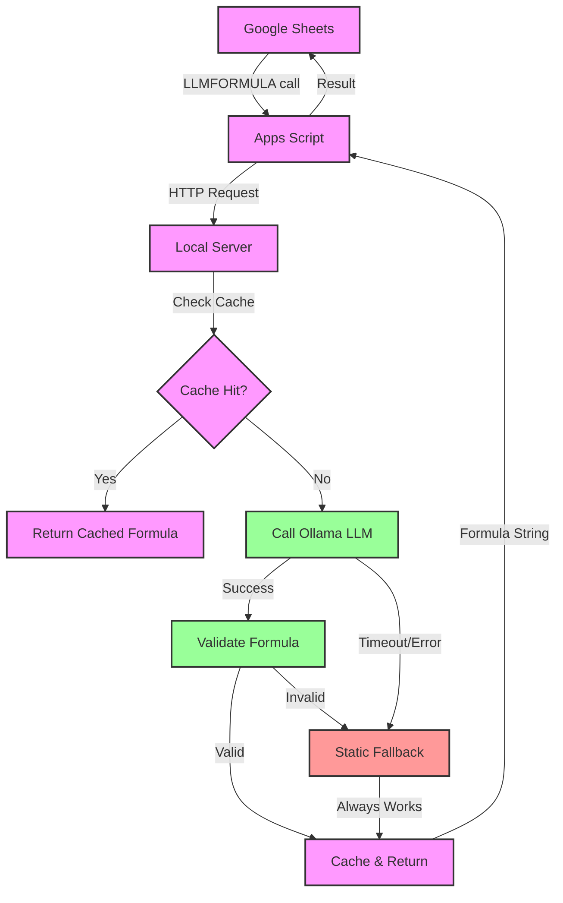

# LLM Formula Generator

## TL;DR

A 100% free Google Sheets custom function (`=LLMFORMULA(range, description)`) that uses a local LLM to auto-generate formulas. No API keys, no subscriptions, no free tiers - just push to GitHub and deploy to Codespaces.


## What You Get

### ✅ Complete Working System
- Interactive Web UI for formula generation
- Local LLM Server (Ollama + phi3:mini)
- Google Apps Script Integration (`=LLMFORMULA(A2:A10, "CAGR")`)
- Robust Fallback System (works offline)
- Multiple Deployment Options (Codespaces, local, Railway)

### ✅ Production-Ready Features
- Caching (5min TTL, auto-cleanup)
- Error Handling (graceful degradation)
- Security Validation (no dangerous functions)
- 60+ Formula Patterns (financial, statistical, time-series)
- Performance Optimized (<100ms fallbacks, ~3s LLM)

### ✅ Zero Cost Architecture
- Server Hosting: GitHub Codespaces (60h/month free)
- LLM: Local Ollama (phi3:mini - 2.3GB)
- Domain: Codespace auto-generates HTTPS URL
- Storage: GitHub repo (unlimited public repos)
- Total Cost: $0 forever

## 🏗️ Architecture



## Example Usage

```javascript
// In Google Sheets:
=LLMFORMULA(A2:A10, "CAGR")
=LLMFORMULA(B1:B20, "sum excluding zeros")
=LLMFORMULA(C2:C50, "moving average 7 periods")
```

**Returns actual working formulas:**
- `=POWER(INDEX(A2:A10,ROWS(A2:A10))/INDEX(A2:A10,1),1/(ROWS(A2:A10)-1))-1`
- `=SUMIF(B1:B20,"<>0")`
- `=AVERAGE(OFFSET(C2,ROW()-ROW(C2)-6,0,7,1))`

For detailed usage examples and tips, see [Usage Guide](docs/USAGE.md)

## 💻 Web UI

This project now includes a simple, clean web interface for generating formulas directly in your browser. Just start the server and navigate to the root URL (e.g., `http://localhost:3000`) to use it.

**Features:**
- Interactive form to describe your desired formula and cell range.
- Real-time formula generation.
- "Copy to Clipboard" button for easy use.
- Displays the source of the formula (LLM, fallback, or cache).

## ⚙️ Configuration

The application can be configured using environment variables:

| Variable | Description | Default |
| --- | --- | --- |
| `PORT` | The port the server will run on. | `3000` |
| `OLLAMA_ENABLED` | Set to `false` to disable the LLM and rely only on static fallbacks. | `true` |
| `OLLAMA_MODEL` | The name of the Ollama model to use. | `phi3:mini` |
| `OLLAMA_TIMEOUT` | Timeout for LLM requests in milliseconds. | `8000` |

## Quick Start

For setup instructions, see [QUICKSTART.md](QUICKSTART.md)

## Documentation

- [Quick Setup Guide](QUICKSTART.md) - Get up and running in 5 minutes
- [Usage Guide](docs/USAGE.md) - How to use LLMFORMULA effectively
- [Deployment Options](docs/DEPLOYMENT.md) - Various free deployment methods
- [API Documentation](docs/API.md) - API endpoints and integration
- [Testing Guide](TESTING.md) - Comprehensive testing strategy
- [Demo & Showcase](SHOWCASE.md) - Live demonstration options
- [Privacy & Ethics](docs/PRIVACY-ETHICS.md) - Data privacy and AI ethics

## What Makes This Special

- **No Hidden Costs:** No API keys required, no free trial expiration, no rate limiting
- **Production-Ready:** Error handling, caching, monitoring, comprehensive tests
- **Highly Customizable:** Add formulas, change models, custom validation, multiple deployments

## Author

[Omkar Pramod Hankare](https://www.linkedin.com/in/ompramod)
Last updated: 2025-08-14