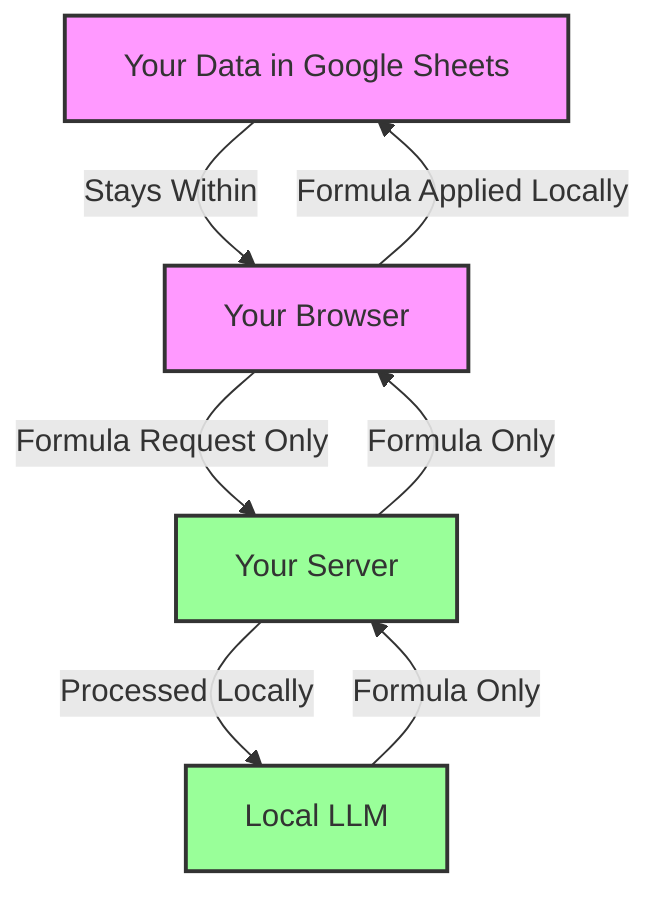

# Privacy & AI Ethics

## Data Privacy

Unlike other AI tools, the LLM Formula Generator was designed with privacy as a primary feature:

### 100% Data Privacy

- **No Data Transmission**: Your data never leaves your environment
- **No Cloud Processing**: Everything runs locally or in your private GitHub space
- **No API Keys**: No third-party services can access your information
- **No Data Collection**: No user data is collected, stored, or analyzed
- **No Telemetry**: No usage statistics are gathered

### Privacy Architecture

### Security Features

- **Input Validation**: All input is sanitized and validated
- **Formula Validation**: Output formulas are checked for dangerous functions
- **No External Dependencies**: The system is self-contained
- **No OAuth Required**: No permissions granted to third parties
- **No Tracking**: No cookies, pixels, or analytics

## AI Ethics Considerations

The LLM Formula Generator incorporates ethical AI principles throughout its design:

### Transparency

- **Visible Formulas**: All formulas are visible and modifiable (not black boxes)
- **Open Source**: All code is available for inspection
- **Clear Documentation**: How the system works is fully explained
- **Formula Provenance**: The source of each formula is indicated (LLM or fallback)

### Human Agency

- **Always Human-Editable**: All generated formulas can be reviewed and modified
- **Tool, Not Replacement**: Enhances human capabilities rather than replacing judgment
- **Optional Use**: Formulas can always be written manually instead

### Accountability

- **Predictable Behavior**: Fallback system ensures consistent results
- **Error Handling**: Clear error messages when issues occur
- **Local Responsibility**: You control the entire system

### Fairness & Accessibility

- **Equal Access**: $0 cost ensures accessibility regardless of resources
- **Low Technical Barrier**: No coding required for end users
- **Offline Functionality**: Works without constant internet connection
- **Multiple Languages**: Can be expanded to support international users

## Limitations & Ethical Considerations

In the spirit of transparency, we acknowledge the following limitations:

- **Knowledge Cutoff**: The LLM has a knowledge cutoff date and won't be aware of new formula techniques
- **Domain Knowledge**: While broad, the model doesn't have specialized knowledge of all industry-specific calculations
- **Bias in Recommendations**: The model may prioritize common formula patterns over specialized alternatives
- **Resource Consumption**: Running LLMs has environmental impacts through computing resources
- **Over-Reliance Risk**: Users may develop dependence instead of learning formula construction

## Future Ethical Improvements

We are committed to continuously improving ethical considerations:

- **Lightweight Models**: Investigating smaller models to reduce resource usage
- **Education Mode**: Adding options to explain formulas for learning
- **Expanded Documentation**: More thorough explanation of system limitations
- **Accessibility Features**: Improving access for users with disabilities
- **Bias Detection**: Tools to identify and mitigate potential biases in formula recommendations

## Comparison to Other AI Tools

| Aspect | LLM Formula Generator | Cloud-Based AI Tools |
|--------|----------------------|---------------------|
| Privacy | 100% local processing | Data sent to cloud servers |
| Transparency | Open source, visible formulas | Often black-box solutions |
| Cost | $0 forever | Usually subscription-based |
| Control | Complete user control | Limited by provider policies |
| Data Usage | No data collection | Often trains on user data |
| Offline Use | Functions without internet | Requires constant connection |

---

Last updated: 2025-08-14  
Author: [om-pramod](https://github.com/om-pramod)
